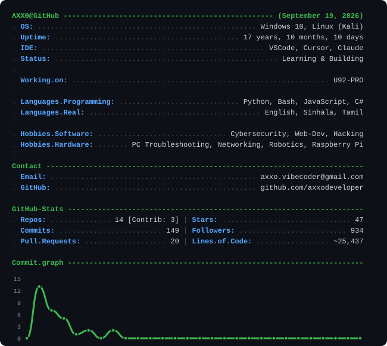

<picture>
  <source media="(prefers-color-scheme: dark)" srcset="github-metrics-dark.svg">
  <source media="(prefers-color-scheme: light)" srcset="github-metrics-light.svg">
  
</picture>

<b>Profile Overview</b>

 
I am Althaf (Axxo), a technology enthusiast from Sri Lanka (🇱🇰), bridging the gap between innovative web design and offensive cybersecurity. My world revolves around the code that builds the web and the techniques that secure it. I specialize in full-stack applications, red team operations, penetration testing, and automation.

